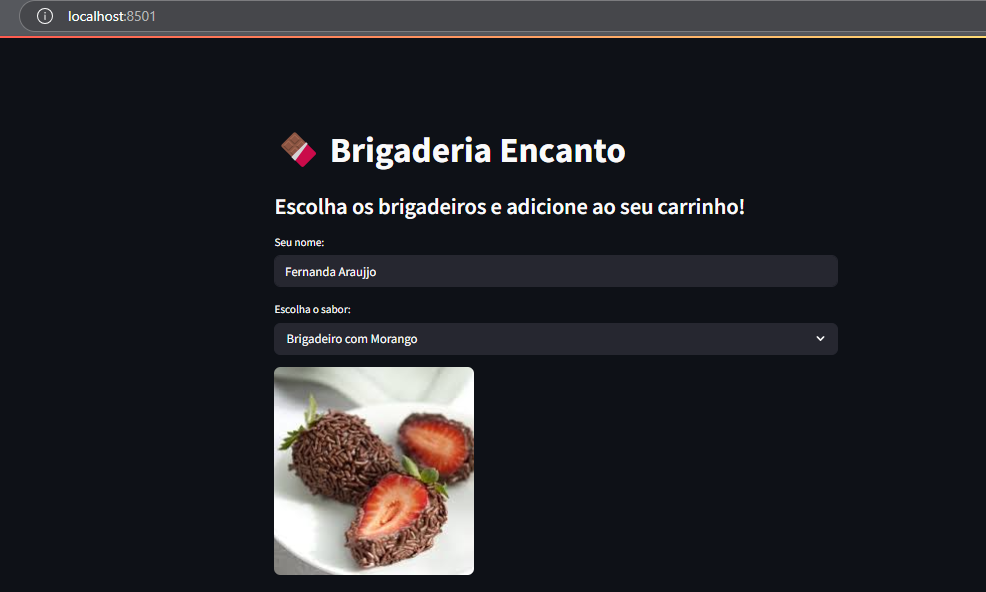
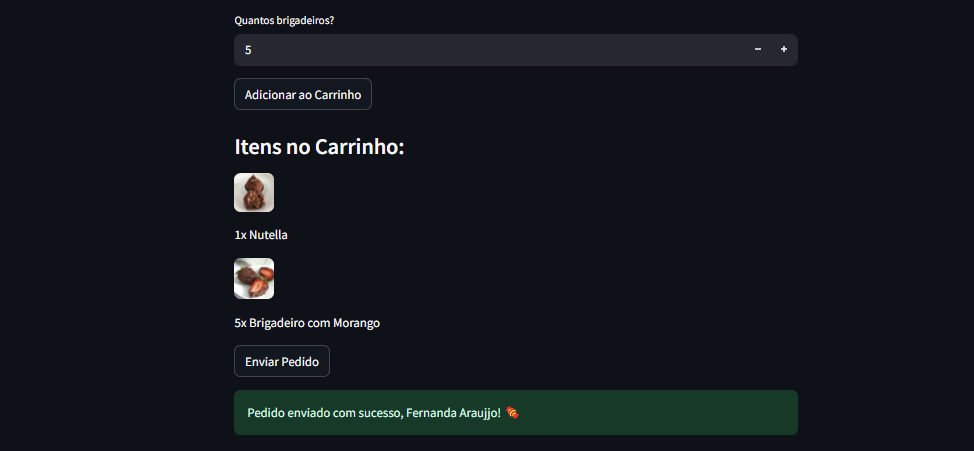

  

<h1 align="center">🍫 Brigaderia Encanto</h1>

  Aplicativo web simples e prático feito com Python + Streamlit para registrar pedidos de brigadeiros artesanais. Ideal para pequenas empresas que desejam organizar seus pedidos digitalmente, com interface amigável e banco de dados local, pronto para crescer junto com o negócio!

---

## 🟫 Descrição do Projeto

O **Brigaderia Encanto** permite o cadastro do cliente e a visualização de pedidos contendo:
- Nome do cliente
- Sabor do brigadeiro:

|**Brigadeiro**                                                  |   **Sabor**                  |
| -------------------------------------------------------------- | ----------------------------|
|       | **Tradicional**             |
|           | **Nutella**                 |
|  | **Brigadeiro com Morango**  |
|  | **Brigadeiro com Castanha** |
|  | **Brigadeiro com Amendoim** |

- Quantidade de unidades
- Carrinho
- Finalizar pedido

Os dados são armazenados localmente em um banco **SQLite**, com estrutura preparada para futura migração para o **Azure SQL Database**.

---

## 🟫 Funcionalidades

- Registro de pedidos com nome, sabor e quantidade
- Validação de campos obrigatórios
- Lista dos pedidos já cadastrados
- Interface leve e responsiva com Streamlit
- Armazenamento local automático (`brigaderia.db`)
- Pronto para ser migrado para banco de dados em nuvem (Azure SQL)

--- 

## 🟫 Teste

  

  

---

## 🟫 Tecnologias Utilizadas

- **Linguagem**: 
- **Framework Web**: 
- **Banco de Dados Local**: 
- **Bibliotecas**:
  - 
  - 
  - 
- **Ambiente Virtual**: 
- **Editor**: 
- **Controle de Versão**: 

---

## 🟫 Como rodar o projeto localmente

1. **Clone o repositorio**:

bash

`git clone https://github.com/AraujoTech1/brigaderia-encanto.git` 

2. **Ative o ambiente virtual**:

- No Windows:

 bash
 
 `python -m venv venv` 

 Depois

`venv\Scripts\activate` 

3. **Instale as dependências**:

bash

`pip install -r requirements.txt` 

4. **Rodando o projeto**:

bash

`streamlit run app.py` 

**Após rodar o comando acima, o aplicativo estará disponível no seu navegador localmente.**

---
## ⚖️ Licença ⚖️

Este projeto está licenciado sob a Licença MIT - veja o arquivo [LICENSE](./LICENSE) para mais detalhes.

---

Desenvolvido com 🤎 e ☕!

